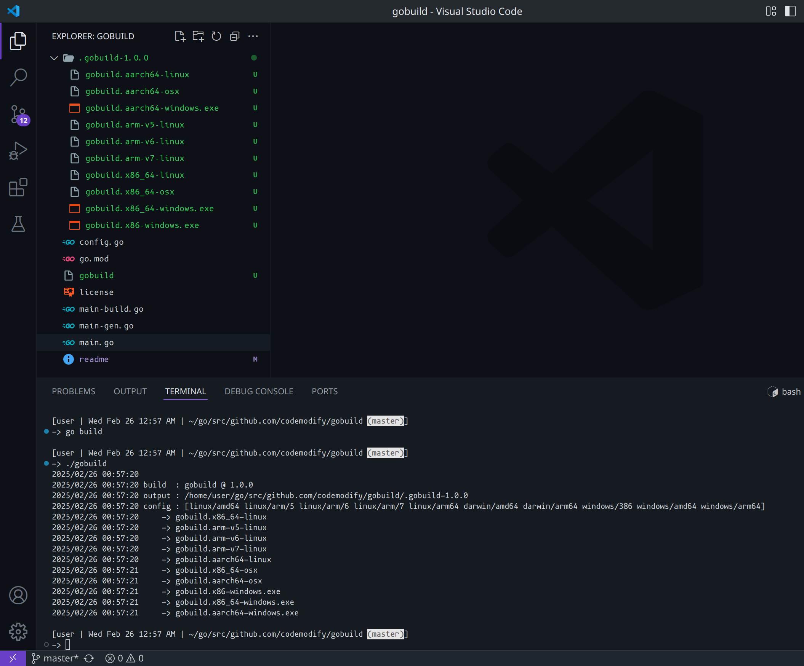

# what
- builds go code for multiple paltforms

# install
- go install github.com/codemodify/gobuild@latest

# run
- cd MY-GO-PROJECT
- gobuild

# customize
- cd MY-GO-PROJECT
- gobuild gen
	- generates `.gobuild` file with platforms to remove / add
	- generates `.gobuild-version` file with the version to set (`-X main.version=` for `-ldflags`)
	- generates `.gobuild-binary` file with the binary file name

# screens
- here is how it looks like building this package using itself
